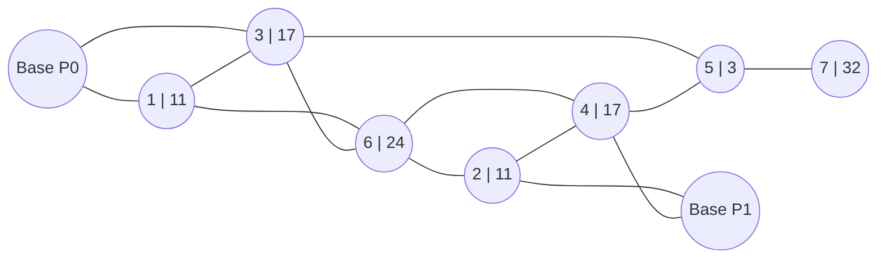

# Game Alpha

## Overview

Two players compete for demand on a fixed graph over a fixed number of turns. Each turn, both
players move drones between nodes; drones present at a node capture a share of that node's demand
proportional to the capacity they bring. Reward accumulates over the whole game. A match has no
winner: what counts is the reward you collect, over all matches of a tournament (see
"Tournament and ranking").

This document is the complete definition of the game. You will not get the game's source code or
a simulator, so everything needed to write a strategy, or to build your own simulator, is here.
Your deliverable is one Python class, described in "Your strategy".

## Map

The map is fixed and the same in every match. It is an undirected graph with 9 nodes. Each number
in a node label (`node | demand`) is the demand available at that node each turn.



| node | demand | role              |
|-----:|-------:|-------------------|
| 0    | 0      | base of player 0  |
| 1    | 11     |                   |
| 2    | 11     |                   |
| 3    | 17     |                   |
| 4    | 17     |                   |
| 5    | 3      |                   |
| 6    | 24     |                   |
| 7    | 32     |                   |
| 8    | 0      | base of player 1  |

Edges (undirected):

```
0–1  0–3  1–3  1–6  3–6  3–5  6–2  6–4  2–4  2–8  4–8  4–5  5–7
```

The same data, and every other constant in this document, as Python you can copy:

```python
N_NODES = 9
NODE_DEMANDS = [0, 11, 11, 17, 17, 3, 24, 32, 0]  # index = node id
EDGES = [
    (0, 1), (0, 3), (1, 3), (1, 6), (3, 6), (3, 5), (6, 2),
    (6, 4), (2, 4), (2, 8), (4, 8), (4, 5), (5, 7),
]  # undirected
BASES = [0, 8]  # index = player_id
DRONES_PER_PLAYER = 20
DRONE_CAPACITY = 5
N_TURNS = 100
```

## Units

Each player has 20 drones, and all of them start at their base. Every drone has capacity 5.

Drones are never created or destroyed, so each player has exactly 20 drones for the whole game.
Any number of drones, from either player, may be at the same node. Drones may move onto any node,
including the opponent's base.

## Your strategy

A strategy is a Python class with two methods:

```python
class MyStrategy:
    def __init__(self, player_id: int) -> None:
        self.player_id = player_id  # 0 or 1

    def act(self, obs: dict) -> list[tuple[int, int, int]]:
        return []  # this turn's moves; see "Observation" and "Action"
```

- A new instance is created for every match, with `player_id` 0 or 1.
- `act` is called once per turn, 100 times per match. You can keep state on `self` between turns.
- Your `player_id` is not in the observation. Store it in `__init__`.
- If `act` raises an exception, takes too long or crashes, you forfeit the rest of the match (see
  "End of game").

Your `player_id` tells you where your base is:

| `player_id` | your base | opponent's base |
|------------:|----------:|----------------:|
| 0           | 0         | 8               |
| 1           | 8         | 0               |

Node ids are the same for both players: the map is not mirrored for player 1.

## Turn order

Each turn:

1. both players' `act(obs)` are called with the observation for the current turn,
2. each returns its action (a list of moves),
3. both players' moves are applied, then that turn's reward is paid out (see "Scoring"), then
   the turn number goes up by one.

Moves are simultaneous: neither player sees the other's moves for this turn before choosing its
own. Each player only moves its own drones, so the order in which the two players' moves are
applied makes no difference.

**Each drone moves at most one edge per turn.** A move can only use drones that were at
`from_node` at the start of the turn. Drones that arrive at a node during a turn cannot move on
until the next turn. For example, from the start position, `[(0, 1, 20), (1, 6, 20)]` moves 20
drones to node 1, and the second move is illegal.

The game is deterministic: there is no randomness anywhere in it.

## Observation

Each turn your strategy's `act(obs)` receives a `dict`:

```python
{
    "turn": int,  # current turn, starting at 0
    "player_drones": list[int], # length 9, index = node id: your drones at that node
    "opponent_drones": list[int], # length 9, index = node id: opponent's drones at that node
    "player_reward_last_turn": float, # reward obtained by you in the last turn
    "opponent_reward_last_turn": float, # reward obtained by the opponent in the last turn
    "player_cumulative_reward": float, # total reward obtained by you so far
    "opponent_cumulative_reward": float,  # total reward obtained by the opponent so far
    "n_invalid_actions_last_turn": int, # number of your illegal moves in the last turn
    "action_format_correct_last_turn": bool, # whether your last action was well-formed
}
```

You see everything: the positions of all drones, both players' rewards, and the full map (fixed,
see "Map"). The total number of turns is not in the observation (see "End of game").

On turn 0 there is no last turn yet: both `*_reward_last_turn` fields are `0.0`,
`n_invalid_actions_last_turn` is `0`, and `action_format_correct_last_turn` is `True`.

## Action

Terms used below: an **action** is what `act` returns for one turn. It is a list of **moves**.

```python
[(from_node, to_node, count), ...]
```

- Each move sends `count` of your drones from `from_node` to `to_node` along one edge.
- An empty list means "do nothing". Drones that are not moved stay where they are.
- Moves in the list are applied in order.

Two things can go wrong, and next turn's observation reports them separately.

**Malformed action:** the whole action is ignored for that turn, as if you had returned `[]`.
Next turn, `action_format_correct_last_turn` is `False` and `n_invalid_actions_last_turn` is `0`,
because no move was looked at. The format is checked strictly:

- the action must be a `list` (not a tuple, not `None`, not any other type),
- each move must be a `tuple` of exactly 3 items (a list like `[0, 1, 5]` is malformed),
- each item must be a plain Python `int`. `bool` values and numpy integers such as `np.int64`
  are malformed. Convert them with `int(...)`.

**Illegal move:** the action is well-formed, but one move breaks a rule. Only that move is
skipped, the rest of the list still applies, and it adds 1 to `n_invalid_actions_last_turn`. A
move is illegal if:

- `from_node` or `to_node` is not a node id (0–8),
- `from_node` and `to_node` are not connected by an edge (this includes `from_node == to_node`),
- `count` is negative,
- `count` is more than the drones you still have at `from_node` from the start of the turn, after
  earlier moves in the same list (see "Turn order").

A move with `count` 0 is legal and does nothing.

## Scoring

After all moves are applied, each node's demand is split between the players at that node:

```
capacity_i = drones_i * drone_capacity                       # drone_capacity = 5
served_i   = capacity_i * demand / max(total_capacity, demand)
```

`total_capacity` is the sum of both players' capacity at that node. The formula has two cases:

- **Demand exceeds total capacity** (`total_capacity < demand`): every player serves its full
  capacity, `served_i = capacity_i`, and part of the demand goes unserved.
- **Total capacity meets or exceeds demand** (`total_capacity >= demand`): the demand is shared
  in proportion to capacity, `served_i = demand * capacity_i / total_capacity`.

For example, at node 7 (demand 32), 2 drones against 1 drone gives `10` and `5`; 8 drones against
4 drones gives `21.33` and `10.67`.

A node with no demand (both bases) or no drones contributes nothing. Your reward for a turn is
the sum of `served_i` over all nodes. Your score in a match is the sum of your rewards over all
turns.

### Worked example: turn 0

Both players start with 20 drones at their base.

- Player 0 plays `[(0, 1, 10), (0, 3, 10)]`.
- Player 1 plays `[(8, 4, 12), (8, 2, 6)]`.

After the moves, player 0 has 10 drones at node 1 and 10 at node 3. Player 1 has 12 at node 4, 6
at node 2, and 2 still at its base (node 8). No node is contested, so each player is scored alone:

| node | demand | drones  | capacity | served |
|-----:|-------:|--------:|---------:|-------:|
| 1    | 11     | P0: 10  | 50       | 11     |
| 3    | 17     | P0: 10  | 50       | 17     |
| 4    | 17     | P1: 12  | 60       | 17     |
| 2    | 11     | P1: 6   | 30       | 11     |
| 8    | 0      | P1: 2   | 10       | 0      |

Both players get reward 28 for turn 0. Player 0's observation on turn 1 is then:

```python
{
    "turn": 1,
    "player_drones":   [0, 10, 0, 10, 0, 0, 0, 0, 0],
    "opponent_drones": [0, 0, 6, 0, 12, 0, 0, 0, 2],
    "player_reward_last_turn": 28.0,
    "opponent_reward_last_turn": 28.0,
    "player_cumulative_reward": 28.0,
    "opponent_cumulative_reward": 28.0,
    "n_invalid_actions_last_turn": 0,
    "action_format_correct_last_turn": True,
}
```

## End of game

The game ends after 100 turns (turns 0 to 99). There is no winner: each player's result is its
score, the reward it collected.

Your strategy forfeits the rest of the match if it raises an exception, takes longer than
1 second for one call of `act` (10 seconds for `__init__`), or crashes. You keep the reward
collected until then. From that turn on your moves are empty: your drones stay where they are and
still take their share of each node's demand, but what they collect no longer counts for you. The
opponent plays on to the end.

## Tournament and ranking

Your strategy plays a tournament: every strategy in it (those of the other participants and a few
reference strategies) plays every other one, in both seats. A separate tournament is played for
each game and each budget setting.

Your result in a tournament is your **revenue share**: the total reward your strategy collected in
all its matches, divided by the total reward collected by all strategies in the tournament.
Winning or losing a match does not count, only reward does: your own reward counts in full, an
opponent's reward only through the tournament's total, which it shares with every other strategy.
Across games, the revenue shares are averaged.
